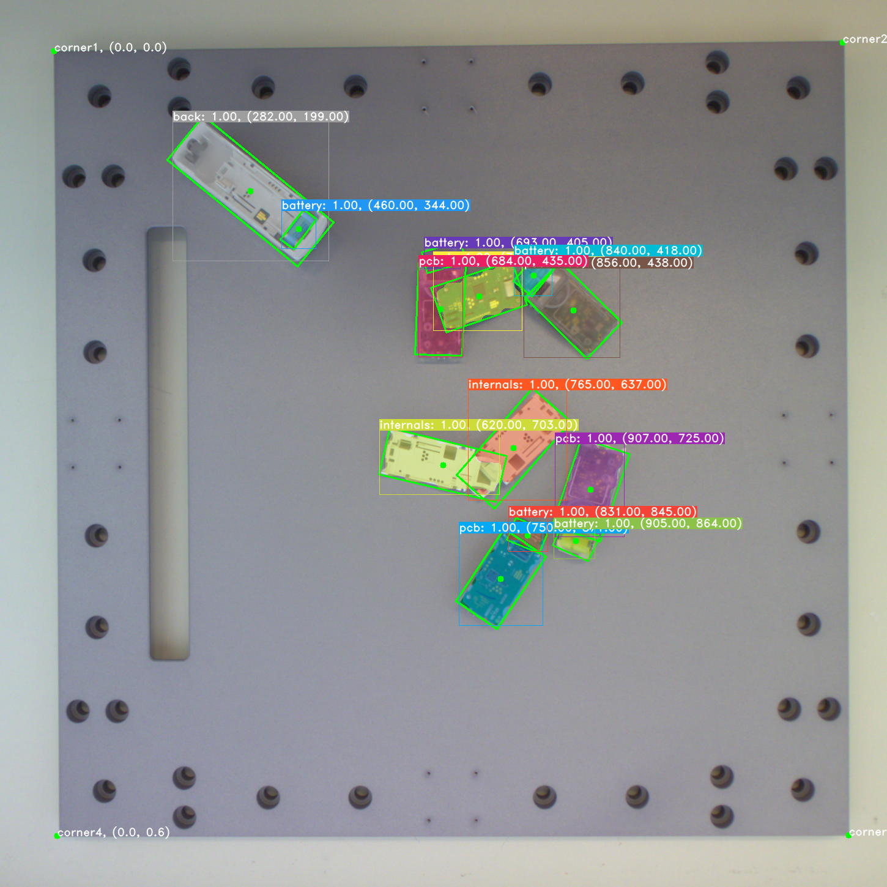

# Reconcycle Object Tracking Pipeline

Project to track heat cost allocators and the individual parts of the heat cost allocator.




## Device Classification

Each device has a unique class that is called `label_precise`. See the following charts:


## Detections

Each detection has the following attributes:
- id (int): index in detections list
- tracking_id (int): unique ID per label that is stable across frames.

- label (Label): hca/smoke_detector/battery...
- label_face (LabelFace/None): front/back/side1/side2
- label_precise (str/None): 01/01.1/02...
- label_precise_name (str/None): kalo/minal/fumonic/siemens/...
- score (float): segmentation confidence

- tf_px (Transform): transform in pixels
- box_px (array): bounding box in pixels
- obb_px (array): oriented bounding box in pixels
- center_px (array): center coordinates in pixels
- polygon_px (Polygon): polygon segmentation in pixels

- tf (Transform): transform in meters
- box (array): bounding box in meters
- obb (array): oriented bounding box in meters
- center (array): center coordinates in meters
- polygon (Polygon): polygon segmentation in meters

- obb_3d (array): oriented bounding box with depth in meters

- parent_frame (str): ROS parent frame name
- table_name (str/None): table name of detection location 
- tf_name (str): ROS transform name corresponding to published detection TF

## Installation

1. `git clone git@github.com:ReconCycle/vision_pipeline.git`
2. `git submodule update --init --recursive`
3. Copy the directory from the Nextcloud Reconcycle repository [git-data/vision-pipeline/data](https://cloud.reconcycle.eu/f/21297) to the `vision_pipeline/data_limited` folder.
4. `cp config.example.yaml config.yaml`

Additionally:

- Setup [ros_vision_pipeline](https://github.com/ReconCycle/ros-vision-pipeline).
- Setup [ros-basler](https://github.com/ReconCycle/ros-basler) camera.
- Setup [ros-realsense](https://github.com/ReconCycle/ros-realsense) camera.

## Camera Calibration

Look at the documentation in [ros-basler](https://github.com/ReconCycle/ros-basler).

## Usage

Set the parameters you want in `config.yaml`. For a specific camera there are the following options available:
```yaml
target_fps: 10
max_allowed_acquisition_delay: 2.0 # in seconds
rotate_img: 0 # specify in degrees
topic: "realsense" # topic that we publish to: /node_name/topic
camera_node: "/realsense" # camera node
image_topic: "color/image_raw"
info_topic: "color/camera_info"
depth_topic: "aligned_depth_to_color/image_raw"
sleep_camera_on_exit: False #! debug, usually set to True
publish_labelled_img: True
publish_depth_img: True
publish_cluster_img: True
publish_graph_img: False
has_depth: True
run_continuous: True
wait_for_services: True # only disable for rosbag
detect_arucos: False # GOE only
camera_height: 0.20 # height in meters
parent_frame: 'panda_2/realsense' # When publishing TFs, this will be the parent frame.
create_parent_frame: False # GOE only
marker_lifetime: 1 # in seconds
debug_clustering: False
```

Run example:
```
python ros_pipeline.py
```

For the Basler camera (Realsense is equivalent), enabling continuous mode without gap detection:
```
rosservice call /vision/basler/continuous False
```
Getting single shot detection, without gap detection:
```
rosservice call /vision/basler/get_detection False
```

**Publishes**:

Basler:

- `/vision/basler/colour`, Image
- `/vision/basler/colour/compressed`, CompressedImage
- `/vision/basler/detections`, ROSDetections
- `/vision/basler/markers`, MarkerArray
- `/vision/basler/poses`, PoseArray

Realsense:

- `/vision/realsense/colour`, Image
- `/vision/realsense/colour/compressed`, CompressedImage
- `/vision/realsense/detections`, ROSDetections
- `/vision/realsense/markers`, MarkerArray
- `/vision/realsense/poses`, PoseArray
- `/vision/realsense/gaps`, ROSGaps
- `/vision/realsense/cluster`, Image
- `/vision/realsense/mask`, Image
- `/vision/realsense/depth`, Image
- `/vision/realsense/lever`, PoseStamped

**Services**:

To run the vision pipeline on an image use the service:

- `/vision/basler/process_img`
- `/vision/realsense/process_img`

See [context_action_framework/src/ProcessImg.srv](https://github.com/ReconCycle/context_action_framework/blob/main/srv/ProcessImg.srv).


To enable or disable the cameras **This should not be required. Cameras are automatically enabled on start, and disabled on program exit**:

- `/vision/basler/enable` True/False
- `/vision/realsense/enable` True/False

To enable/disable continuous mode:

- `/vision/basler/continuous` True/False
- `/vision/realsense/continuous` True/False

To get a single detection:

- `/vision/basler/get_detection` True/False
- `/vision/realsense/get_detection` True/False

where True/False is whether to provide gap detection. See [context_action_framework/srv/VisionDetection.srv](https://github.com/ReconCycle/context_action_framework)

To enable/disable certain topics from being published:

- `/vision/basler/labelled_img/enable` True/False
- `/vision/basler/graph_img/enable` True/False
- `/vision/basler/debug/enable` True/False

- `/vision/realsense/labelled_img/enable` True/False
- `/vision/realsense/graph_img/enable` True/False
- `/vision/realsense/depth_img/enable` True/False
- `/vision/realsense/cluster_img/enable` True/False
- `/vision/realsense/debug/enable` True/False


**Example:**

The `/vision/*/get_detection` service provides a single stable detection result from the requested camera.

For example, to get one Basler detection, run:

```
rosservice call /vision/basler/get_detection False
```
To get a Realsense detection, run:
```
rosservice call /vision/realsense/get_detection True
```
where True provides the gaps as well.

**Camera Services:**

- `/basler/set_sleeping` True/False
- `/realsense/enable` True/False

These are called internally and shouldn't be used manually.

## Saving Images

Open `vision_pipeline/image_saver.py` and change the line:
```python
self.camera_node = "realsense" #! options: realsense/realsensed405/basler
```
to match your desired camera.

Run it, and press any key to save an image.


# Dataset Creation and Training

## Labelling Images with Segmentation for use with Yolact

```bash
git clone https://github.com/wkentaro/labelme
cd labelme
conda create --name=labelme python=3.6
conda activate labelme
pip install --editable .
cd labelme
labelme
```

### How to Generate COCO dataset from labelme labelled data

1. Create `labels.txt` file in the same directory as the labelled data with contents of your labels:
```
__ignore__
_background_
hca_front
hca_back
hca_side1
hca_side2
battery
pcb
internals_back
internals_front
internals
```
2. Run command:
```bash
cd labelme/examples/instance_segmentation
./labelme2coco.py data_annotated data_dataset_coco --labels labels.txt
```
For example:
```bash
./labelme2coco.py /Users/sebastian/datasets/labelme/kalo_v2_imgs_20-11-2020-selected /Users/sebastian/datasets/labelme/kalo_v2_imgs_20-11-2020-selected-coco --labels /Users/sebastian/datasets/labelme/kalo_v2_imgs_20-11-2020-selected/labels.txt
```

### Create Train Test Split from COCO .json file

Use the script in `tools/coco-train-test-split/cocosplit.py` to split the COCO .json file into a train.json and test.json.

## How to Train Yolact

In this project this [Yolact API](https://github.com/sebastian-ruiz/yolact) is used.

**These instructions are no longer valid.**

1. Create dataset with NDDS. Make sure instance segmentations and class segmentations are produced.
2. Generate COCO format using the **ndds-to-coco** tool. First test wether it's producing what you want by setting `TESTING_STAGE=True`.
To check whether it worked properly, use the **coco-viewer** tool. Using `TESTING_STAGE=True` set `CATEGORIES` correctly.
3. Open `yolact/data/config.py` and set the following correctly: `NDDS_COCO_CLASSES`, `NDDS_COCO_LABEL_MAP` and the paths in `coco_ndds_dataset`.
4. To start training, replace num_gpus and run:
```
$ export CUDA_VISIBLE_DEVICES=0,1,2 (or whichever GPUs to use, then)
$ python -m yolact.train --config=coco_ndds_config --save_interval=2000 --batch_size=8*num_gpus
```
To resume:
```
$ python -m yolact.train --config=coco_ndds_config --resume=weights/****_interrupt.pth --start_iter=-1 --save_interval=2000 --batch_size=8*num_gpus
```
For training on less data, reduce the save_interval. On few real images use `--save_interval=200` instead.

5. To view logs run: `tensorboard --logdir=yolact/runs`.

<!-- First we train on synthetic data.

1. Create dataset with NDDS. Make sure instance segmentations and class segmentations are produced.
2. Generate COCO format using the **ndds-to-coco** tool. First test wether it's producing what you want by setting `TESTING_STAGE=True`.
To check whether it worked properly, use the **coco-viewer** tool. Using `TESTING_STAGE=True` set `CATEGORIES` correctly.
3. Open `yolact/data/config.py` and set the following correctly: `NDDS_COCO_CLASSES`, `NDDS_COCO_LABEL_MAP` and the paths in `coco_ndds_dataset`.
4. To start training, replace num_gpus and run:
```
$ export CUDA_VISIBLE_DEVICES=0,1,2 (or whichever GPUs to use, then)
$ python -m yolact.train --config=coco_ndds_config --save_interval=2000 --batch_size=8*num_gpus
```
To resume:
```
$ python -m yolact.train --config=coco_ndds_config --resume=weights/****_interrupt.pth --start_iter=-1 --save_interval=2000 --batch_size=8*num_gpus
```
For training on less data, reduce the save_interval. On few real images use `--save_interval=200` instead.

6. After training on synthetic data, train using the synthetic weights, but on real data.

Make sure that the class labels of the real data match those of the synthetic data. Use Cocoviewer to get the order of the class labels for the real data.
Example:
```
NDDS_COCO_CLASSES = ('background', 'back', 'battery', 'front', 'internals', 'pcb', 'side2', 'side1')
#                     1             2       3          4        5            6       7       8      # let these always be the corresponding class labels
# for YOLACT the labels need to start at 1
NDDS_COCO_LABEL_MAP = {1:  1,  2:  2,  3:  3,  4:  4,  5:  5,  6:  6,  7:  7,  8:  8,}

# From looking at COCOViewer, we get the following order of the real class labels (with the corresponding label IDs on the next line):
# REAL_CLASSES = ('background', 'front', 'back', 'side1', 'side2', 'battery', 'pcb', 'internals')
#                0             1        2       3        4        5          6      7
# Actually what we want is for the class labels to be in the same order as in NDDS_COCO_CLASSES. To do this we create the REAL_LABEL_MAP as follows:
REAL_LABEL_MAP = {0: 1, 1: 4, 2: 2, 3: 8, 4: 7, 5: 3, 6: 6, 7: 5}
# we set the labels so that they correspond to the NDDS_COCO_CLASSES. We therefore also use the  NDDS_COCO_CLASSES in the config for the real data.
```

Train on real data:
```
python train.py --config=real_config --resume=weights/training_15-01-2021-segmented-battery/coco_ndds_57_36000.pth --start_iter=0
```

7. Done! -->

## Inference

Todo.


<!-- ## Deeplabcut - DEPRECATED (using OpenCV instead for corner detection)

To install:
```
cd dlc/DeepLabCut-2.2b8
./reinstall.sh
```
Note: this is done automatically when using the [ros-vision-pipeline](https://github.com/ReconCycle/ros-vision-pipeline) Docker container.

### Deeplabcut Training

1. Take a folder of images to annotate. Use the script in `tools/img-to-video/convert-png-to-avi.py` to convert the images to a video.
2. Edit the script `dlc/dlc_create_environment.py` by commenting in each step on its own and then run:
```
cd vision-pipeline/
python -m dlc.dlc_create_environment
```


### Deeplabcut Inference

In the `data/config_override.py` set the config parameters. Set `dlc_config_file` to point to your dlc config `.yaml` file. -->

<!-- ## NDDS

### Changelog

- 15/01/2021: Changed the all_internals to have label pcb on the side where the pcb is visible and internals on the side where the white plastic is visible

### Convert NDDS to COCO dataset format

This must be done after generating images with NDDS. Make sure that instance segmentation and class segmentation masks are produced by NDDS.

1. Open `tools/ndds-to-coco/ndds-to-coco-multiprocessing.py`.
2. Set `DATA_DIR` directory and set your class labels in `CATEGORIES`.
3. Run  `ndds-to-coco-multiprocessing.py` with `TESTING_STAGE = True`.
4. Open `tools/coco-viewer/cocoviewer.py` and set the `DATA_DIR` directory correctly. Run and check that the mask labels are correct.
5. Run  `ndds-to-coco-multiprocessing.py` with `TESTING_STAGE = False`. Wait an hour or so to do it's thing... -->